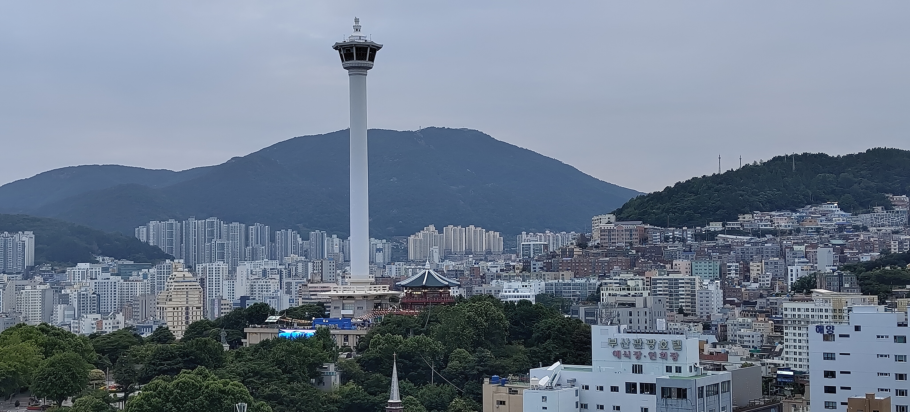
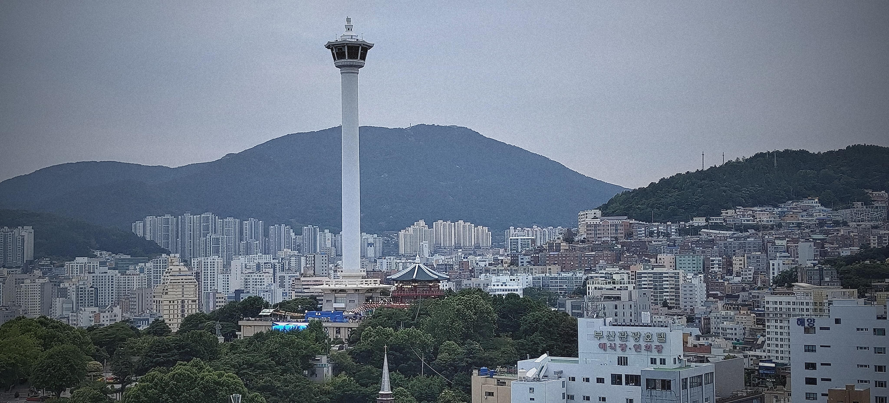

# Image Processor
A basic CLI program that applies some basic filters to a given image

## Dependencies
- uv: This is a python package manager and venv manager
- numpy
- scipy
- pillow
- argparse

## Usage
In order to run the program, use the following command:  
- `` uv run image-processor "file_path" <args> ``

#### Positional Arguments 
  - **`filename`** — Path to the image file to process 

#### Options

- **`-b`, `--blur`** — Apply a box blur to the image
- **`-bg`, `--blur_gaussian`** — Apply a Gaussian blur to the image
- **`-i`, `--invert`** — Invert the image's colors
- **`-e`, `--edge`** — Detect and highlight edges in the image
- **`-v`, `--vignette`** — Apply a vignette (darkened corners) effect
- **`-s`, `--sepia`** — Apply a sepia tone filter
- **`-fg`, `--film_grain`** — Add film grain noise to the image
- **`-g`, `--grayscale`, `--greyscale`** — Convert the image to grayscale
- **`-sat`, `--saturate`** — Boost the image's color saturation

## Examples

- **Original**  

- **After Film Grain and Vignette Added**  

- **After Edge Detection**
